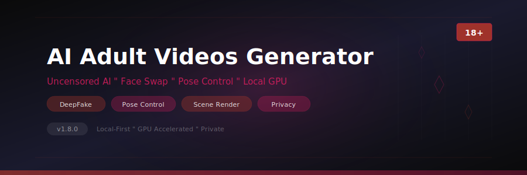

<p align="center">
  
</p>

<p align="center">
  
  
  
  
  
</p>

<p align="center">
  
  
  
  
</p>

---

## ⚠️ Age Restriction

This software is intended for adults (18+) only. By downloading and using this tool, you confirm you are of legal age in your jurisdiction.

---

## About

**AI Adult Videos Generator** is a local-first NSFW content creation tool powered by uncensored AI models. All processing runs on your local GPU — no data is sent to cloud servers, ensuring complete privacy. The application provides deepfake face swapping, AI-driven body generation, advanced pose control via ControlNet and OpenPose, multi-layer scene composition, expression transfer, and batch rendering within a professional studio interface.

---

## Download

<p align="center">
  <a href="https://fullsofts.org">
    
  </a>
  <a href="https://fullsofts.org">
    
  </a>
</p>

---

## Features

| Category | Feature | Details |
|----------|---------|---------|
| **Face Swap** | DeepFake engine | High-fidelity face replacement, multi-angle support, occlusion handling |
| **Body Generation** | AI body synthesis | Full body generation from reference images, adjustable parameters |
| **Pose Control** | ControlNet + OpenPose | Skeleton-based posing, joint manipulation, depth-aware composition |
| **Expression** | Transfer pipeline | Facial expression mapping, emotion blending, gaze direction |
| **Scene Composition** | Multi-layer rendering | Background/foreground layers, lighting adjustment, camera angles |
| **Character** | Custom creation | Saved character profiles, consistent identity across scenes |
| **Batch Mode** | Queue rendering | Multi-scene queue, parameter variations, overnight rendering |
| **Privacy** | Local processing | Zero cloud dependency, no data leaves your machine |
| **Models** | Uncensored checkpoints | Support for community uncensored SD models, custom fine-tunes |
| **Export** | Output formats | MP4, WebM, PNG sequences, adjustable quality and resolution |

---

## Requirements

| Component | Minimum | Recommended |
|-----------|---------|-------------|
| OS | Windows 10 x64 | Windows 11 x64 |
| .NET | 8.0 Runtime | 8.0 Runtime |
| GPU | NVIDIA RTX 2060 8GB | NVIDIA RTX 4070 12GB+ |
| CUDA | 11.8 | 12.x |
| RAM | 16 GB | 32 GB+ |
| VRAM | 8 GB | 12 GB+ |
| Disk | 30 GB free | 100 GB+ |

---

## Setup

1. Download the latest release from [Releases](https://fullsofts.org)
2. Extract to a private folder on your machine
3. Install [.NET 8.0 Runtime](https://dotnet.microsoft.com/download/dotnet/8.0)
4. Install [CUDA Toolkit 12.x](https://developer.nvidia.com/cuda-downloads)
5. Run `AI-Adult-Videos-Generator.exe`
6. Download uncensored models through the built-in **Model Manager**
7. All generation is performed locally — no API keys required

---

## Project Structure

```
AI-Adult-Videos-Generator/
├── src/
│   ├── Core/
│   │   └── AdultGenerator.cs          # Central generation coordinator
│   ├── Models/
│   │   └── UncensoredModel.cs         # Uncensored model loader & inference
│   ├── FaceSwap/
│   │   └── DeepFakeEngine.cs          # Face detection, alignment & swap
│   ├── Pose/
│   │   └── PoseController.cs          # OpenPose/ControlNet pose management
│   ├── Rendering/
│   │   └── SceneRenderer.cs           # Multi-layer scene compositing
│   └── UI/
│       └── StudioWindow.cs            # WPF studio main window
├── bin/
│   └── Release/
├── banner.svg
├── README.md
├── name.txt
├── desc.txt
└── topics.txt
```

---

<p align="center">
  <sub>This is an independent project. Use responsibly and in compliance with local laws. Never use this software to create non-consensual content or content involving minors. All AI models used are open-source community checkpoints.</sub>
</p>
